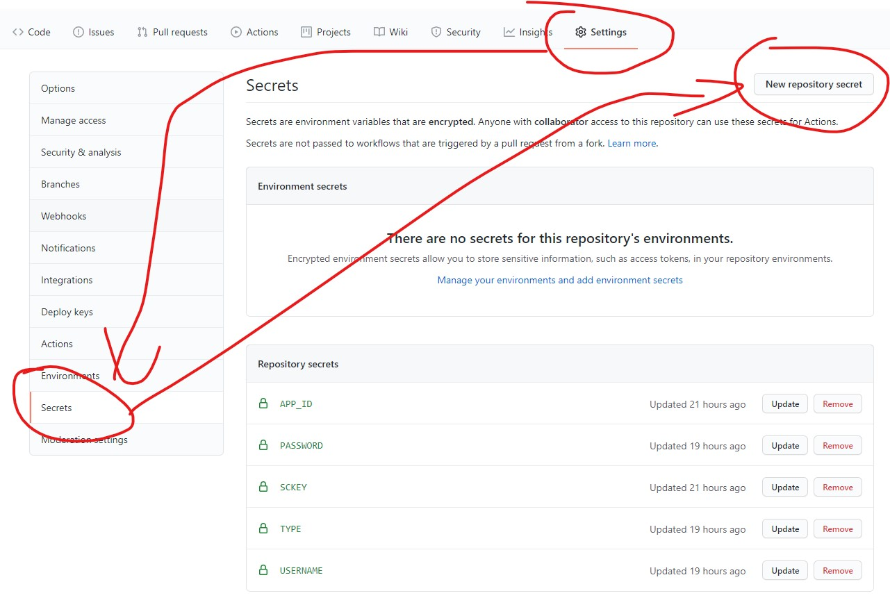
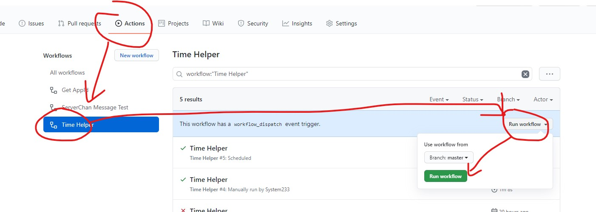

# 完美校园打卡机


MM再也不用担心自己上光荣榜了  
如果此程序对你有用，右上给个一键三连吧😂（误）

## 目录

+ [快速配置](#快速配置)
  + [Fork本项目](#fork本项目)
  + [注册Server酱](#注册server酱)
  + [设置Secrets](#设置secrets)
  + [获取AppID](#获取appid)
  + [测试打卡](#测试打卡)
  + [令牌登录](#令牌登录)
+ [命令行工具](#命令行工具)
  + [APPID工具](#APPID工具)
  + [消息测试工具](#消息测试工具)
  + [配置向导](#配置向导)
  + [启动打卡](#启动打卡)
+ [Secret配置](#secret配置)

## 快速配置

### Fork本项目

点击页面右上角的`Fork`按钮，将仓库复制到自己账号  


### 注册Server酱

Server酱用于配置微信通知和获取参数。  
可以用Github账号登录，很快啊，啪一下就登录了。  
然后绑定你的微信，顺便发个消息试试。  

[点击注册](https://sc.ftqq.com/3.version)

登录注册之后就可以看到你的`SCKEY`，记下来等下一步用。

### 设置Secrets

配置程序运行参数，支持参数列表见[Secret配置](#secret配置)  
位置：`Settings`=>`Secrets`=>`New reposltory secret`


建议的配置值如下

|名称|值|
|-|-|
|TYPE|password|
|USERNAME|用户名/手机号|
|PASSWORD|密码|
|SEED|随便输个数字|
|APP_ID|打卡项目ID，暂时不填，等下一步获取|
|SCKEY|上一步拿到的SCKEY|

### 获取AppID

注意：Actions功能可能默认关闭，如果关闭就先启用一下（怎么启用我忘了）。  
位置：`Actions`=>`Get AppId`=>`Run workflow`=>`Run workflow`  

点击绿色按钮运行GetAppID程序，运行完成后手机上应该收到一条通知，类似这样：  

|打卡项目|APP_ID|
| - | - |
|教职工打卡|teacher|
|学生打卡|student|
|其他人|other|

看好你所在的组，记下后面的`APP_ID`，回到[第三步:设置Secrets](#设置secrets)将`APP_ID`添加到Secrets中

### 测试打卡

所有参数设置完毕，接下来运行打卡程序进行测试  
位置：`Actions`=>`Time Helper`=>`Run workflow`=>`Run workflow`  

如果配置正确，手机上应该收到打卡成功的通知，否则可能会收到异常报告。  
如果`SCKEY`没有配置或错误，结果会输出到Action日志中。  

### 令牌登录

更新：测试失败,此模式在Github服务器上不可用。
  
```markdown
每天打卡都登录可能有点奇怪，因此程序提供了令牌免登录功能。 
经过前几步配置并正常打卡后，用同样的步骤运行Actions中的`Get Token`程序  
位置：`Actions`=>`Get Token`=>`Run workflow`=>`Run workflow`  
稍后微信将会收到可用于服务器的Token配置，样子如下：  
|名称|值|
|-|-|
|TYPE|token|
|TOKEN|*****|
参照[设置Secrets](#设置secrets)步骤将值更新至Secrets，再次运行打卡测试  
位置：`Settings`=>`Secrets`=>`Update`  
如果正常，微信应该收到打卡成功或频繁打卡通知。
```

## 命令行工具

运行命令前先克隆仓库到本地，并安装node.js 14.x版本（测试平台）  
然后运行`npm install`命令安装项目依赖

### APPID工具

获取打卡项目ID

```sh
npm run appId
```

### 消息测试工具

测试你的Server酱正不正常。

```sh
npm run send <标题> <内容>
```

### 配置向导

配置向导可以引导你配置关键参数，并输出配置结果

```sh
npm run setup
```

### 启动打卡

运行之后开始打卡

```sh
npm run main
```

## Secret配置

这里包含了所有支持在Secret中配置的字段。  
建议设置`SEED`或`DEVICE_ID`字段来固定设备ID。

|名称|类型/可选值|默认值|说明|
|-|-|-|-|
|TYPE|password、sms、token||登录类型，password:密码、sms：短信，token：令牌|
|USERNAME|string||用户名/手机号|
|PASSWORD|string||密码|
|TOKEN|string||令牌，根据教程获取|
|APP_ID|string||打卡项目ID，根据教程获取|
|TEMP_RANGE|string|35.4-36.9|体温范围（可选）|
|SCKEY|string||Server酱SCKEY（可选）|
|TEXT_OK|string|芜湖~打卡完成！|成功提示信息（可选）|
|USER_AGENT|string|...|登录使用的UA（可选）|
|USER_AGENT2|string|...|打卡使用的UA（可选）|
|MODEL|string|HUAWEI INE-AL00|设备型号（可选）|
|MODEL_CODE|string|INE-AL00|设备代号（可选）|
|SYSTEM_VERSION|number|9|系统版本（可选）|
|SYSTEM_TYPE|android|android|系统类型（可选）|
|DEVICE_ID|string||设备ID（可选）|
|DEVICE_SEED|number|`Math.random()*0xFFFF0000`|设备ID生成种子（可选）|
|PROXY_HOST|string||代理主机（可选）|
|PROXY_PORT|number||代理端口（可选）|
|APP_VERSION|number|10525101|完美校园版本（可选）|
